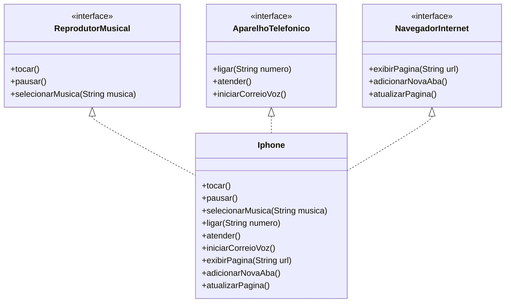

# 📱 Modelagem e Diagramação de um Componente iPhone

## 📖 Sobre o projeto

Este projeto foi desenvolvido como parte do desafio **"Modelando o iPhone com UML: Funções de Músicas, Chamadas e Internet"** da plataforma **DIO (Digital Innovation One)**.

O objetivo é aplicar os conceitos de **Programação Orientada a Objetos (POO)** em Java, utilizando **interfaces**, **polimorfismo** e **implementação de contratos**, modelando as principais funcionalidades apresentadas no lançamento do iPhone em 2007.

---

## 🎯 Funcionalidades

O iPhone foi modelado para executar três funcionalidades principais:

### 🎵 Reprodutor Musical

- Tocar música
- Pausar música
- Selecionar música

### 📞 Aparelho Telefônico

- Ligar
- Atender chamadas
- Iniciar correio de voz

### 🌐 Navegador na Internet

- Exibir página
- Adicionar nova aba
- Atualizar página

---

## 🛠 Tecnologias utilizadas

- Java
- Programação Orientada a Objetos (POO)
- Interfaces
- UML
- Git
- GitHub

---

## 📂 Estrutura do projeto

```text
src
│
└── equipamentos
    │
    ├── aparelho
    │   └── Iphone.java
    │
    ├── interfaces
    │   ├── ReprodutorMusical.java
    │   ├── AparelhoTelefonico.java
    │   └── NavegadorInternet.java
    │
    └── Main.java
```

---

# 📊 Diagrama UML



---

## ▶️ Como executar

1. Clone este repositório:

```bash
git clone https://github.com/seu-usuario/nome-do-repositorio.git
```

2. Abra o projeto em sua IDE Java de preferência (Visual Studio Code, IntelliJ IDEA ou Eclipse).

3. Execute a classe:

```text
Main.java
```

---

## 📚 Conceitos aplicados

- Classes
- Interfaces
- Implementação de Interfaces
- Polimorfismo
- Organização em pacotes
- Encapsulamento
- UML (Unified Modeling Language)

---

## 👩‍💻 Autora

**Danielle Almeida**

Graduanda em Engenharia de Software

GitHub: https://github.com/Dani-Almeida
